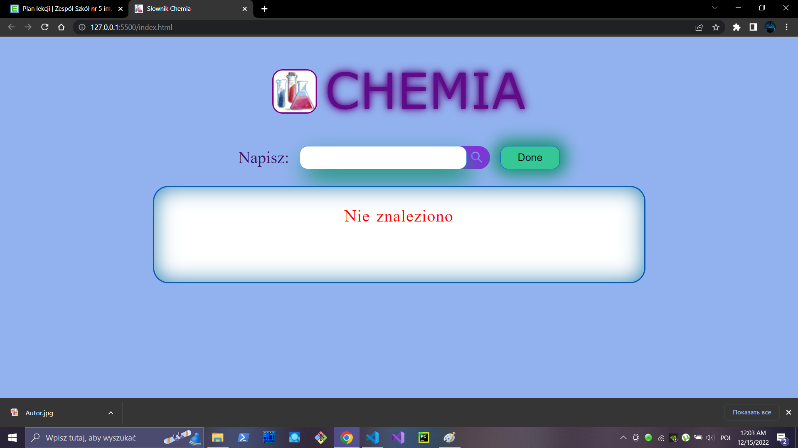

    
     
    Słownik Chemia
     
    Repository: InternetChemia
     
    Autor: Uladzimir Haleta
     
    DeadLine: 14.12.2022
     
    <a href="https://vol123.github.io/InternetChemia/" style="font-size: 25px;">Link on the site</a>
     
     
    Screen my site
     
     
    
     
     
    

    This site will put an end to all the learning of all chemical elements by heart and will give a new opportunity for development, not only in terms of study, but also in science too. The brightest idea came into my head a long time ago and made it a little earlier in c #, but with the new technology of posting on the Internet, this will allow you to use this program. This program is very cool!
    

